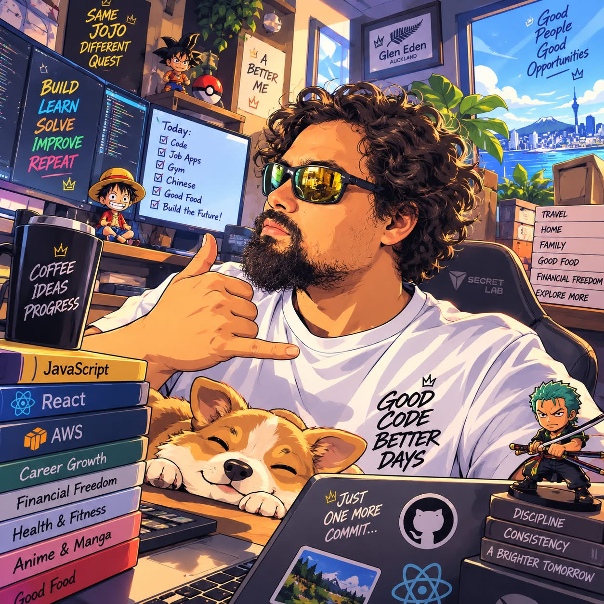

# Bula! I'm Joseph Chang 👋

### Product & Implementation • Technical Support • Software Development

📍 Auckland, New Zealand

## 👨‍💻 A little about me

I'm a customer-focused tech professional who enjoys working where **people and technology meet**.

My path into tech hasn't been the most traditional one. Before software development, I worked across travel, insurance, customer service, training and stakeholder engagement. These days I get to combine that people-focused background with building things, troubleshooting problems and helping others feel more confident with technology.

I enjoy understanding **why** something isn't working, breaking the problem down, and finding a practical solution without losing sight of the person using it.

I'm particularly interested in **product implementation, application & technical support, customer-facing technology and software development**.

And yes... I will probably always have another side project going somewhere. 😅

## 🛠️ Tech I work with

**Development:** JavaScript • TypeScript • React • Next.js • Node.js • HTML • CSS  
**Data & integrations:** REST APIs • JSON • MySQL • MongoDB  
**Support:** Microsoft 365 • Teams • SharePoint • User support • Troubleshooting  
**Tools & delivery:** Git • GitHub • Vercel • Postman  
**AI-assisted development:** Cursor and other AI tools for prototyping, investigation and development, followed by manual review, testing, debugging and refactoring

## 🚀 What I've been building

### 🌱 AgrInvest
A responsive business website built with **Next.js and TypeScript**. I worked directly with the business owners to refine requirements, content and design before deployment, while also helping set up Google Workspace and business email.

> The source repository is currently private while the business prepares for launch.

### 🥊 Pasifika Fighter Prototype
A 3D fighting game prototype built with **Godot/GDScript**, inspired by Pasifika mythology. I've worked on movement, combat, blocking, hit feedback, health, round management and plenty of debugging when the fighters decided not to behave. 😅

> Currently maintained as a private development repository.

### 🔧 Web Application Refactoring & Technical Support
Worked with an existing React application to investigate issues and break larger components into smaller, reusable pieces while preserving established functionality. This has also given me practical experience using AI-assisted development as part of a review → test → debug → refactor workflow rather than treating generated code as a finished answer.

## 🤝 The people side of tech

One thing I've learned from training and supporting people is that solving the technical problem is only half the job.

I like asking questions, figuring out where someone is actually stuck and explaining things in plain language rather than throwing jargon at them. Whether I'm helping someone understand a development problem, troubleshooting access to a system or working through requirements for a website, I try to leave the person with a better understanding than when we started.

## ☁️ Certification

**AWS Certified Cloud Practitioner**  
Issued March 2024 • Valid through March 2027

## 🎮 When I'm not doing tech things...

There's a pretty good chance I'm gaming, watching anime, reading manga/web novels, experimenting with another project, or wondering why the "quick little feature" I started building has somehow become a whole new project. 😂

I grew up across Europe before settling in New Zealand, so I've also picked up a love of different cultures, food and meeting people from all sorts of backgrounds along the way.

## 📊 A bit of GitHub nerdiness

## 📫 Let's connect

**Thanks for stopping by! 👋**

